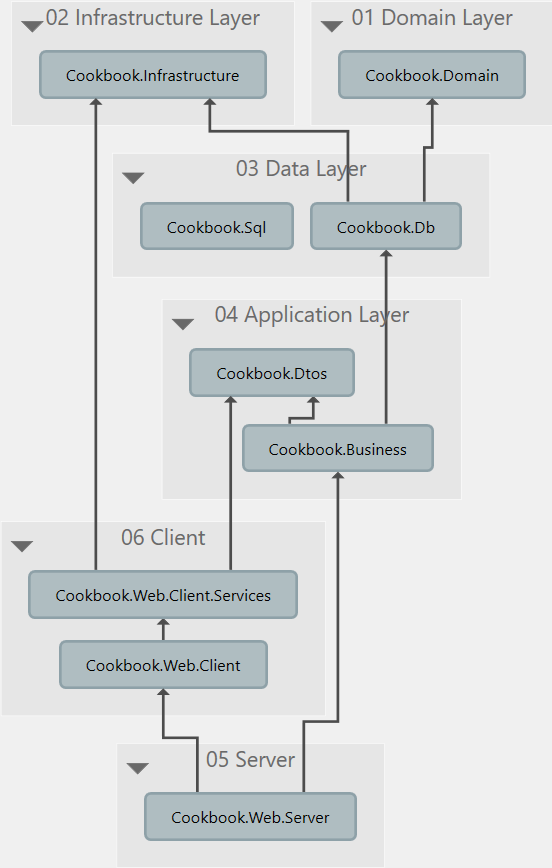

# Cookbook
A recipe manager made with Blazor, Asp.Net Core and EF Core.

## Project setup

*Note: this image is outdated, though the structure is similar*

### 01 Domain Layer

Contains domain objects.
These are in EF terms all entities that are persisted on the database.
This also contains all contracts/interfaces these entities need.
E.g. an `IDbItem` which provides an ID property.

### 02 Infrastructure Layer

Contains helper code that all other projects need and does not fit any other place.

### 03 Data Layer

Contains all code related to data access.

* `Cookbook.Db` is the C# code to access the data such as EF contexts and repositories.
* `Cookbook.Sql` contains helpful SQL files.

### 04 Application Layer

Contains the server-side business logic and DTO's.

* `Cookbook.Dtos` contains all DTO objects and related contracts/interfaces needed for both front and backend.
* `Cookbook.Business` contains server-side business logic that maps the Domain to the Dto and any logic that has knowledge about what exactly the DTO's are.

### 05 Client

Contains the frontend Blazor application.

* `Cookbook.Web.Client.Services` encapsulates all calls to the server api.
* `Cookbook.Web.Client` contains the actual blazor code.

### 06 Server

Contains the ASP.Net code which is mostly the API and a single Blazor page call.

## Debugging

To debug the Blazor application follow the following steps:

1. Build the app in Debug configuration
2. Open chrome with this command (filling in the correct port): `%programfiles(x86)%\Google\Chrome\Application\chrome.exe --remote-debugging-port=9222 http://localhost:52734`
3. Press `Alt+Shift+D` to open the debug window
    1. If this doesn't work, make sure your extensions aren't using the shortcut itself
4. In the sources tab you can see the `.dll` files where you can place breakpoints

For more info see: https://blazor.net/docs/debugging.html

## Links

* Blazor: https://blazor.net/
* ASP.Net Core: https://www.asp.net/core
* EF Core: https://docs.microsoft.com/en-us/ef/core/